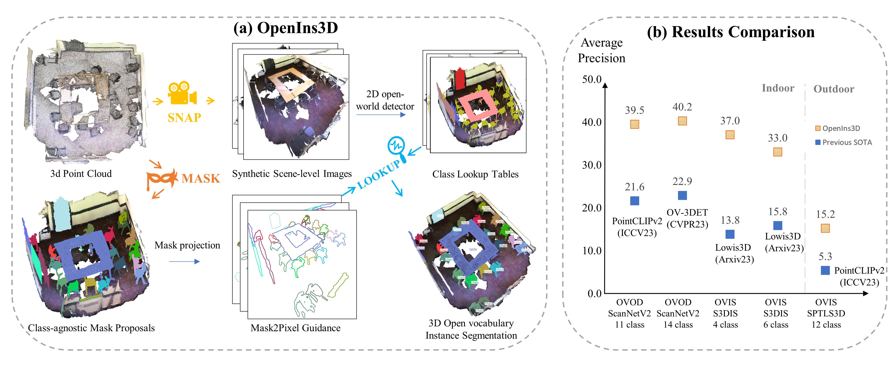

<p align="center">

  <h1 align="center"> OpenIns3D: Snap and Lookup for 3D Open-vocabulary Instance Segmentation</h1>
  <p align="center">
    <a href="https://zheninghuang.github.io/"><strong>Zhening Huang</strong></a>
    ·
    <a href="https://xywu.me"><strong>Xiaoyang Wu</strong></a>
    ·
    <a href="https://xavierchen34.github.io/"><strong>Xi Chen</strong></a>
    ·
    <a href="https://hszhao.github.io"><strong>Hengshuang Zhao</strong></a>
    <a href="https://sites.google.com/site/indexlzhu/home"><strong>Lei Zhu</strong></a>
    ·
    <a href="http://sigproc.eng.cam.ac.uk/Main/JL"><strong>Joan Lasenby</strong></a>
  </p>
  
  <h3 align="center"><a href="https://arxiv.org/abs/2309.00616">Paper</a> | <a href="https://www.youtube.com/watch?v=kwlMJkEfTyY">Video</a> | <a href="https://zheninghuang.github.io/OpenIns3D/">Project Page</a></h3>
  <div align="center"></div>
</p>

   
[](https://paperswithcode.com/sota/zero-shot-3d-point-cloud-classification-on-1?p=openins3d-snap-and-lookup-for-3d-open) [](https://paperswithcode.com/sota/3d-open-vocabulary-instance-segmentation-on-3?p=openins3d-snap-and-lookup-for-3d-open)
[](https://paperswithcode.com/sota/3d-open-vocabulary-object-detection-on-1?p=openins3d-snap-and-lookup-for-3d-open)
[](https://paperswithcode.com/sota/3d-open-vocabulary-instance-segmentation-on-1?p=openins3d-snap-and-lookup-for-3d-open)
<p align="center">
<strong> TL;DR: OpenIns3D proposes a "mask-snap-lookup" scheme to achieve 2D-input-free 3D open-world scene understanding, which attains SOTA performance across datasets, even with fewer input prerequisites. 🚀✨
</p>


<table>
<tr>
    <td></td>
    <td></td>
    <td></td>
</tr>
<tr>
    <td align='center' width='24%'>device to watch BBC news</td>
    <td align='center' width='24%'>furniture that is capable of producing music</td>
    <td align='center' width='24%'>Ma Long's domain of excellence</td>
<tr>
<tr>
    <td></td>
    <td></td>
    <td></td>
</tr>
<tr>
    <td align='center' width='24%'>most comfortable area to sit in the room</td>
    <td align='center' width='24%'>penciling down ideas during brainstorming</td>
    <td align='center' width='24%'>furniture offers recreational enjoyment with friends</td>
<tr>
</table>


<br>

# OpenIns3D pipeline




# Highlights
- *6 Jan, 2024*: We have released a major revision, incorporating S3DIS and ScanNet benchmark code. Try out the latest version [here](#benchmarking-on-scannetv2-and-s3dis) 🔥🔥.
- *31 Dec, 2023* We release the [batch inference code on ScanNet](#benchmarking-on-scannetv2-and-s3dis).
- *31 Dec, 2023* We release the [zero-shot inference code](#zero-shot-scene-understanding)， test it on your own data!
- *Sep, 2023*: **OpenIns3D** is released on [arXiv](https://arxiv.org/abs/2309.00616), alongside with [explanatory video](https://www.youtube.com/watch?v=kwlMJkEfTyY), [project page](https://zheninghuang.github.io/OpenIns3D/). We will release the code at end of this year.

# Overview

- [Installation](#installation)
- [Zero-Shot Scene Understanding](#zero-shot-scene-understanding)
- [Benchmarking on ScanNetv2 and S3DIS](#benchmarking-on-scannetv2-and-s3dis)
- [Citation](#citation)
- [Acknowledgement](#acknowledgement)


# Installation

## Requirements

- CUDA: 11.6
- PyTorch: 11.3
- Hardware: one 24G memory GPU or better

(Note: that several scenes in S3DIS are very large and may lead to RAM collapse if 24GB GPU is used)

## Setup 

Install dependencies by running:

```bash
conda create -n openins3d python=3.9
conda activate openins3d

conda install pytorch==1.13.1 torchvision==0.14.1 torchaudio==0.13.1 pytorch-cuda=11.6 -c pytorch -c nvidia
conda install pytorch3d -c pytorch3d
conda install lightning -c conda-forge
conda install -c "nvidia/label/cuda-11.6.1" libcusolver-dev
python -m pip install 'git+https://github.com/facebookresearch/detectron2.git'
conda install nltk

cd third_party/pointnet2
python setup.py install
cd ../

# install MinkowskiEngine for MPM
git clone --recursive "https://github.com/NVIDIA/MinkowskiEngine" # clone the repo to third_party
cd MinkowskiEngine
git checkout 02fc608bea4c0549b0a7b00ca1bf15dee4a0b228
python setup.py install --force_cuda --blas=openblas
cd ../../

# install ODISE as 2D detectors
git clone https://github.com/NVlabs/ODISE.git
cd ODISE
pip install -e .
cd ..

pip install torch_scatter gdown==v4.6.3 loguru open3d plyfile pyviz3d python-dotenv omegaconf==2.1.1 iopath==0.1.8
```


# Zero-Shot Scene Understanding
 
To achieve zero-shot scene understanding with **OpenIns3D**, follow these two steps:
 
1. Download Checkpoint for Mask Proposal Module: 
   - we recommend downloading scannet200_val.ckpt [here](https://drive.google.com/file/d/1emtZ9xCiCuXtkcGO3iIzIRzcmZAFfI_B/view) and placing it under `checkpoints/`.

2. Run `python zero_shot.py` by specifying a) `pcd_path`: the path of the colored point cloud. b）`vocab`: vocabulary list that is searching for. [ODISE](https://github.com/NVlabs/ODISE) is the 2D detector, so the format of vocab is followed ODISE

We provide several sample datasets from `Replica`, `Mattarport3d`, and `S3DIS`, `Scannet` for quick testing. Run the following code to download demo data

```bash
pip install gdown==v4.6.3
cd demo; python download_demo_scenes.py
```

(If you are experiencing issues downloading the demo scene files, please ensure that you have the correct version of gdown)

Example of testing:
 
```bash
# replica demo
python zero_shot.py \
--pcd_path 'demo/demo_scene/replica/replica_scene3.ply' \
--vocab "lamp; blinds; chair; table; door; bowl; window; switch; bottle; indoor-plant; pillow; vase; handrail; basket; bin; shelf; tv-screen; sofa; blanket; bike; sink; bed; stair; refrigerator" \
--dataset replica

# scannet demo
python zero_shot.py \
--pcd_path 'demo/demo_scene/scannet_scene1.ply' \
--vocab "cabinet; bed; chair; sofa; table; door; window; bookshelf; picture; counter; desk; curtain; refrigerator; showercurtain; toilet; sink; bathtub" \
--dataset scannet

# mattarport3d demo
python zero_shot.py \
--pcd_path 'demo/demo_scene/mattarport3d/mp3d_scene1.ply' \
--vocab "chair; window; ceiling; picture; floor; lighting; table; cabinet; curtain; plant; shelving; sink; mirror; stairs;  counter; stool; bed; sofa; shower; toilet; TV; clothes; bathtub; blinds; board" \
--dataset mattarport3d

# s3dis demo
python zero_shot.py \
--pcd_path 'demo/demo_scene/s3dis/s3dis_scene3.npy' \
--vocab "floor; wall; beam; column; window; door; table; chair; sofa; bookcase; board" \
--dataset s3dis

# cuosmtized data 
python zero_shot.py \
--pcd_path 'path/to/your/own/3dscene' \
--vocab "vocabulary list to be used" \
```

The dataset flag is only for adjusting the loading for different .ply files. For customizing the dataset, use 'scanent' as the default. Let us know if you encounter any issues! 📣

## Visulize the results

You can check out the detection results as well as the Snap images, Class_Lookup_Dict, and final results under `demo_saved`. 

When using your coustmize dataset: 

- feel free to change the three parameters [`lift_cam, zoomout, remove_lip`] under `adjust_camera` to optimise the snap images for better detection. 


# Benchmarking on ScanNetv2 and S3DIS

Here we provide instructions to reproduce the results on ScanNetv2 and S3DIS.

(Note: first time run will take a while 🕙 to download checkpoint of 2D detector ODISE automatically)

## ScanNetv2:

1. Download [ScanNetv2](http://www.scan-net.org). (Note: No need to download the `.sens` file as 2D images are not used)
2. Pre-process the ScanNetv2 dataset by following the same code in Mask3d, as follows:


```bash
python -m openins3d.mask3d.datasets.preprocessing.scannet_preprocessing preprocess \
--data_dir="PATH_TO_RAW_SCANNET_DATASET" \
--save_dir="input_data/processed/scannet" \
--git_repo="PATH_TO_SCANNET_GIT_REPO" \
--scannet200=false
```

3. Download the pre-trained Mask Proposal weights from [here](https://omnomnom.vision.rwth-aachen.de/data/mask3d/checkpoints/scannet/scannet_val.ckpt) and place it under `checkpoints`.

4. Double-check three paths under `scannet_benchmark.sh`: include `SCANNET_PROCESSED_DIR`, `SCAN_PATH`, and `MPM_CHECKPOINT`. Change them accordingly. Once changes are made, run the bash file. The bash file will first generate a class-agnostic mask proposal for the 312 scenes, each maks stored as a sparse tensor. Then, Snap and Lookup modules will be implemented under `inference_openins3d.py`.  Eventually, `evaluate.py` can be called to evaluate the performance by calculating the AP values of the mask detections.

```bash
sh scannet_benchmark.sh
```

## S3DIS

1. Download S3DIS data by filling out this [Google form](https://docs.google.com/forms/d/e/1FAIpQLScDimvNMCGhy_rmBA2gHfDu3naktRm6A8BPwAWWDv-Uhm6Shw/viewform?c=0&w=1). Download the Stanford3dDataset_v1.2.zip file and unzip it.

2. Preprocess the dataset with the following code:

```bash
python -m openins3d.mask3d.datasets.preprocessing.s3dis_preprocessing preprocess \
--data_dir="PATH_TO_Stanford3dDataset_v1.2" \
--save_dir="input_data/processed/s3dis"
```

If you encounter issues in preprocessing due to bugs in the S3DIS dataset file, please refer to this [issue](https://github.com/JonasSchult/Mask3D/issues/8#issuecomment-1279535948) in the Mask3D repo to fix it.

3. Download the pre-trained Mask proposal from [here](https://omnomnom.vision.rwth-aachen.de/data/mask3d/checkpoints/s3dis/scannet_pretrained/area5_scannet_pretrained.ckpt) and place it under `checkpoints`.

4. Double-check two file paths under `s3dis_benchmark.sh`: include `S3DIS_PROCESSED_DIR` and `MPM_CHECKPOINT`. Change them accordingly and then run:

```bash
sh s3dis_benchmark.sh
```

(Note that several scenes in S3DIS are very large and may lead to RAM complications if 24GB is used. Large VRAM is recommended.)

# To do
- Release the batch inference code on STPLS3D
- Release checkpoints for limited supervision on S3DIS, ScanNetV2
- Release Evaluation Script for 3D Open-world Object Detection

# Citation

If you find OpenIns3D useful for your research, please cite our work as a form of encouragement. 😊
```
@article{huang2023openins3d,
      title={OpenIns3D: Snap and Lookup for 3D Open-vocabulary Instance Segmentation}, 
      author={Zhening Huang and Xiaoyang Wu and Xi Chen and Hengshuang Zhao and Lei Zhu and Joan Lasenby},
      journal={arXiv preprint},
      year={2023}
    }
```


# Acknowlegement

The mask proposal model is modified from [Mask3D](https://jonasschult.github.io/Mask3D/), and we heavily used the [easy setup](https://github.com/cvg/Mask3D) version of it for MPM. Thanks again for the great work! 🙌 We also drew inspiration from [LAR](https://github.com/eslambakr/LAR-Look-Around-and-Refer) and [ContrastiveSceneContexts](https://github.com/facebookresearch/ContrastiveSceneContexts) when developing the code. 🚀
