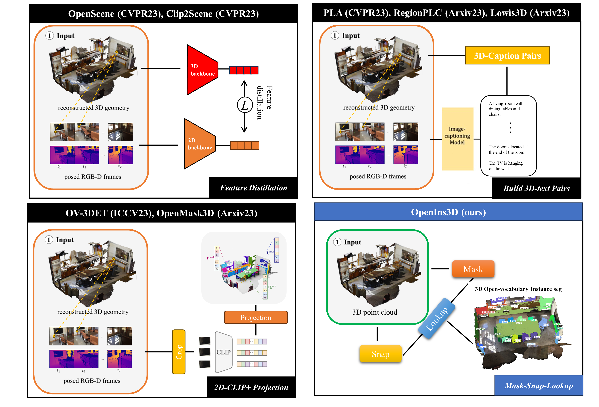

<p align="center">

  <h1 align="center"> OpenIns3D: Snap and Lookup for 3D Open-vocabulary Instance Segmentation</h1>
  <p align="center">
    <a href="https://zheninghuang.github.io/"><strong>Zhening Huang</strong></a>
    ·
    <a href="https://xywu.me"><strong>Xiaoyang Wu</strong></a>
    ·
    <a href="https://xavierchen34.github.io/"><strong>Xi Chen</strong></a>
    ·
    <a href="https://hszhao.github.io"><strong>Hengshuang Zhao</strong></a>
    <a href="https://sites.google.com/site/indexlzhu/home"><strong>Lei Zhu</strong></a>
    ·
    <a href="http://sigproc.eng.cam.ac.uk/Main/JL"><strong>Joan Lasenby</strong></a>
  </p>
  
  <h3 align="center"><a href="https://arxiv.org/abs/2309.00616">Paper</a> | <a href="https://www.youtube.com/watch?v=kwlMJkEfTyY">Video</a> | <a href="https://zheninghuang.github.io/OpenIns3D/">Project Page</a></h3>
  <div align="center"></div>
</p>

<p align="center">
<strong> TL;DR: OpenIns3D is a powerful, 2D input-free, fast-evolving, complex-input-handling framework for 3D open-world scene understanding.
</p>

## 2D-input-free framework




## Complex-input-handling

<table>
<tr>
    <td></td>
    <td></td>
    <td></td>
</tr>
<tr>
    <td align='center' width='24%'>device to watch BBC news</td>
    <td align='center' width='24%'>furniture that is capable of producing music</td>
    <td align='center' width='24%'>Ma Long's domain of excellence</td>
<tr>
<tr>
    <td></td>
    <td></td>
    <td></td>
</tr>
<tr>
    <td align='center' width='24%'>most comfortable area to sit in the room</td>
    <td align='center' width='24%'>penciling down ideas during brainstorming</td>
    <td align='center' width='24%'>furniture offers recreational enjoyment with friends</td>
<tr>
</table>


<br>

## OpenIns3D pipeline


## Highlights
- *Sep, 2023*: **OpenIns3D** is released on [arXiv](https://arxiv.org/abs/2309.00616), alongside with [explanatory video](https://www.youtube.com/watch?v=kwlMJkEfTyY), [project page](https://zheninghuang.github.io/OpenIns3D/). We will release the code at end of this year.


## Citation

```
@article{huang2023openins3d,
      title={OpenIns3D: Snap and Lookup for 3D Open-vocabulary Instance Segmentation}, 
      author={Zhening Huang and Xiaoyang Wu and Xi Chen and Hengshuang Zhao and Lei Zhu and Joan Lasenby},
      journal={arXiv preprint},
      year={2023}
    }
```


